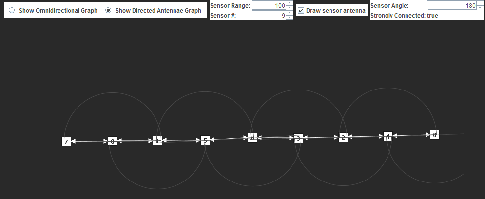
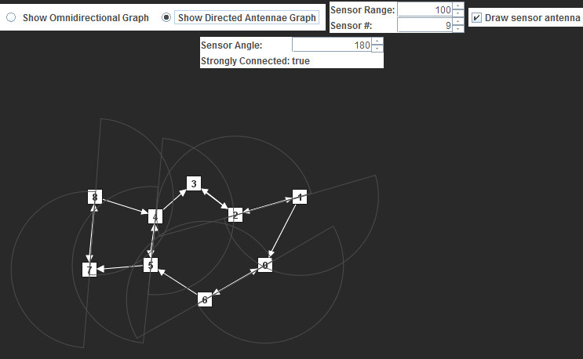
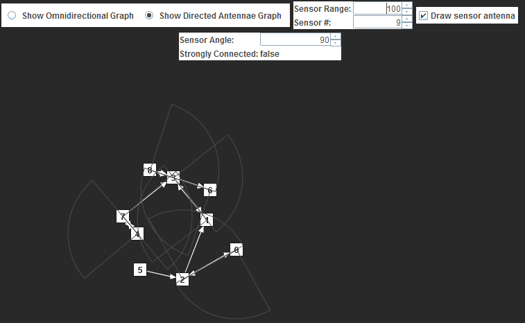

COMP 3203 - Assignment 02
=========================

## Authors

- Anthony D'Angelo
- Nicolas Porter

## Screenshots

## Folders

### bin
Contains the compiled java files, as well as the executable.

### doc
Contains the documentation of our assignment, as well as the requirements.

### lib
Contains the libraries used, as well as their source.

### src
Contains the source files of our assignment.

## Compilation

The project can be imported and compiled in eclipse. The libraries may need to be
added to your build path, but the project should be already configured correctly.
